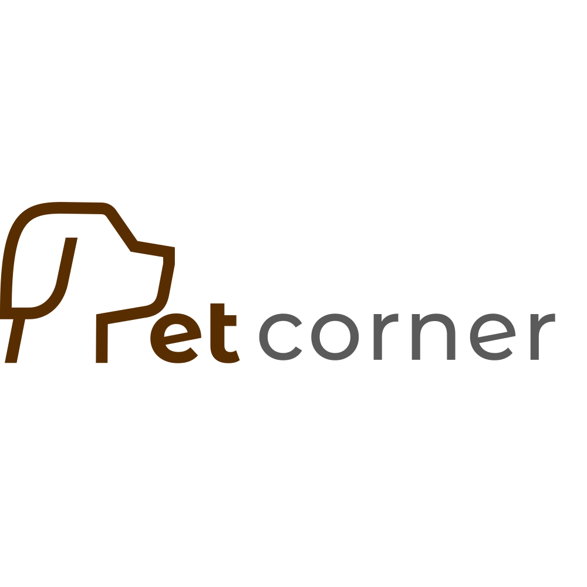
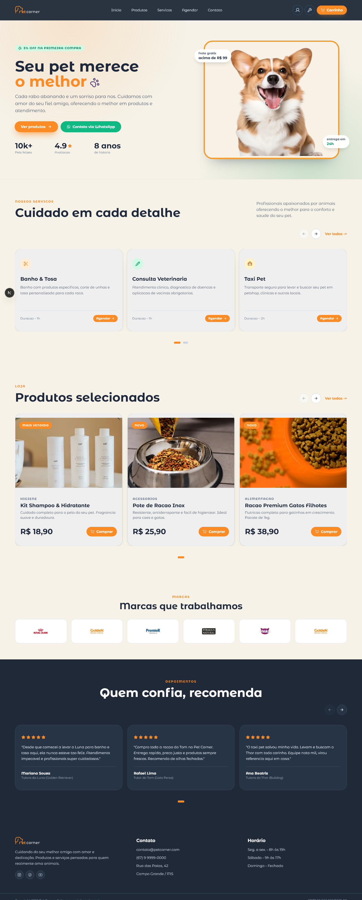
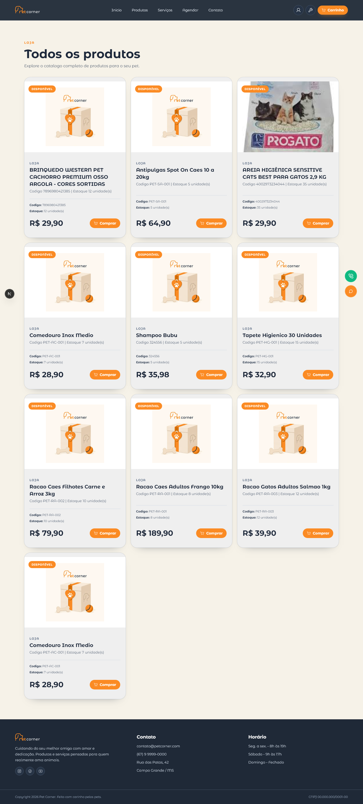
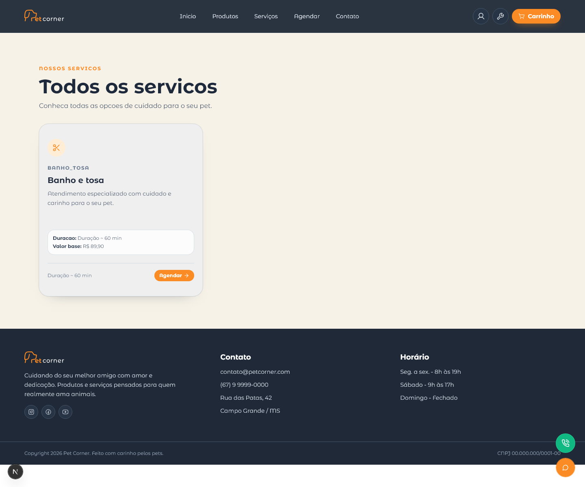
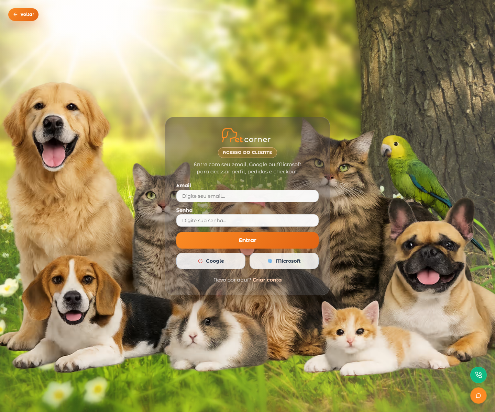
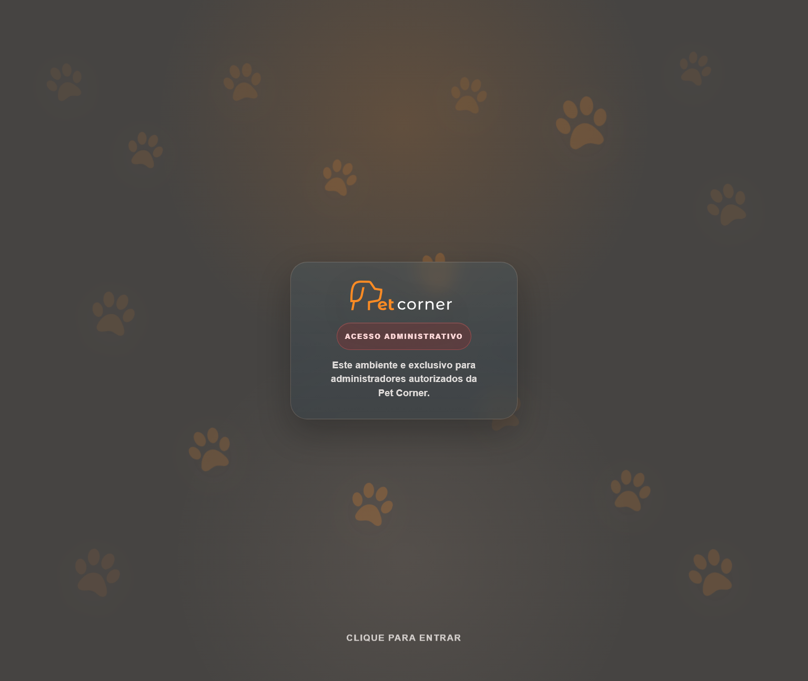

# PetCornerNext

Monorepo do ecossistema PetCorner, com duas aplicacoes principais:

- `petpage`: app publico e area do cliente em Next.js.
- `petCorner`: painel administrativo em React/Vite, tambem publicado dentro do `petpage` em `/app-react`.

O projeto atende o fluxo completo de um pet shop: vitrine de produtos e servicos, cadastro e login de clientes, perfil do cliente, pets, carrinho, checkout, pedidos, agendamentos, painel administrativo, catalogo, notificacoes e integracoes com Firebase, Stripe e Workers.

## Estrutura

```txt
apps/
  petpage/      App Next.js publico, area do cliente e API routes
  petCorner/    SPA administrativa em React/Vite
assets/         Imagens usadas na documentacao
```

O build do `petCorner` usa `base: "/app-react/"` e gera a SPA em:

```txt
apps/petpage/public/app-react
```

Assim, o deploy do `petpage` tambem entrega o painel administrativo em `/app-react`.

## Aplicacoes

### petpage

Aplicacao principal em Next.js App Router. Ela concentra:

- Landing page com produtos, servicos, depoimentos e conteudo carregado do Firestore.
- Catalogo publico de produtos e servicos, incluindo paginas de detalhe.
- Login e cadastro de clientes com Firebase Auth.
- Sessao de cliente por cookie assinado.
- Perfil do cliente com dados pessoais, endereco, pets, pedidos, favoritos e agendamentos.
- Carrinho para visitantes e clientes autenticados.
- Checkout com Stripe em modo de teste.
- Webhook Stripe para sincronizar pedidos.
- Agendamento de servicos com disponibilidade, links de calendario e envio opcional de email.
- Notificacoes do cliente.
- Chat/acoes flutuantes de suporte via Worker.
- Rota `/app-react` para servir o painel administrativo legado/SPA.

Principais pastas:

```txt
apps/petpage/src/app          Rotas, layouts, APIs e metadata
apps/petpage/src/features     Modulos por dominio da aplicacao
apps/petpage/src/lib          Integracoes, auth, Firebase, Stripe e utilitarios
apps/petpage/src/providers    Providers globais do React
apps/petpage/src/styles       CSS global
```

### petCorner

SPA administrativa em React/Vite para a operacao do pet shop. Ela concentra:

- Login administrativo com Firebase.
- Dashboard.
- CRUD de clientes.
- CRUD de animais/pets.
- CRUD de produtos.
- Importacao e sincronizacao de catalogo.
- Upload/importacao de imagens de produtos via Worker.
- CRUD de servicos.
- Gestao de agendamentos e configuracao de disponibilidade.
- Gestao de pedidos e rastreamento.
- Gestao de depoimentos.
- Notificacoes administrativas.
- Chat de consultas com Worker/Gemini.

Principais pastas:

```txt
apps/petCorner/src/screens       Telas administrativas
apps/petCorner/src/components    Layout, records, dashboard, chat e UI compartilhada
apps/petCorner/src/services      Servicos de Firebase, catalogo, pedidos e notificacoes
apps/petCorner/src/hooks         Hooks de dados e operacoes
apps/petCorner/src/validation    Schemas de validacao
```

## Tecnologias

- npm workspaces
- Next.js 16
- React 19
- Vite 7
- TypeScript
- Tailwind CSS no `petpage`
- Firebase Auth
- Firestore
- Firebase Admin SDK no servidor do Next
- Stripe Checkout e Webhooks
- Nodemailer/SMTP para emails de agendamento
- Cloudflare Workers para integracoes auxiliares
- TanStack Query
- React Hook Form e Zod
- MUI no painel administrativo
- Radix/shadcn-style primitives no `petpage`

## Scripts

Na raiz do repositorio:

| Comando | Descricao |
| --- | --- |
| `npm install` | Instala as dependencias dos workspaces |
| `npm run dev:next` | Inicia o `petpage` em desenvolvimento |
| `npm run dev:vite` | Inicia o `petCorner` em desenvolvimento |
| `npm run build` | Builda `petCorner` e depois `petpage` |

Nos workspaces:

```bash
npm run lint --workspace=petpage
npm run lint --workspace=petcorner
npm run build --workspace=petpage
npm run build --workspace=petcorner
```

## Ambiente

Crie os arquivos de ambiente dentro de cada app conforme necessario.

### apps/petpage/.env.local

Variaveis publicas do Firebase:

```env
NEXT_PUBLIC_FIREBASE_API_KEY=
NEXT_PUBLIC_FIREBASE_AUTH_DOMAIN=
NEXT_PUBLIC_FIREBASE_PROJECT_ID=
NEXT_PUBLIC_FIREBASE_STORAGE_BUCKET=
NEXT_PUBLIC_FIREBASE_MESSAGING_SENDER_ID=
NEXT_PUBLIC_FIREBASE_APP_ID=
NEXT_PUBLIC_FIREBASE_MEASUREMENT_ID=
```

Sessao do cliente:

```env
CUSTOMER_SESSION_SECRET=
```

Firebase Admin para rotas server-side:

```env
FIREBASE_ADMIN_PROJECT_ID=
FIREBASE_ADMIN_CLIENT_EMAIL=
FIREBASE_ADMIN_PRIVATE_KEY=
```

Stripe em modo de teste:

```env
STRIPE_SECRET_KEY=sk_test_...
STRIPE_WEBHOOK_SECRET=whsec_...
NEXT_PUBLIC_APP_URL=http://localhost:3000
```

Email de agendamentos, opcional:

```env
APPOINTMENT_EMAIL_ENABLED=false
SMTP_HOST=
SMTP_PORT=587
SMTP_USER=
SMTP_PASS=
SMTP_FROM=
```

Workers, opcionais:

```env
NEXT_PUBLIC_CLOUDFLARE_WORKER_URL=
NEXT_PUBLIC_COSMOS_SYNC_URL=
NEXT_PUBLIC_CHAT_WORKER_URL=
```

### apps/petCorner/.env

Configuracao Firebase exposta ao Vite:

```env
VITE_FIREBASE_API_KEY=
VITE_FIREBASE_AUTH_DOMAIN=
VITE_FIREBASE_PROJECT_ID=
VITE_FIREBASE_STORAGE_BUCKET=
VITE_FIREBASE_MESSAGING_SENDER_ID=
VITE_FIREBASE_APP_ID=
VITE_FIREBASE_MEASUREMENT_ID=
```

Workers usados no painel administrativo:

```env
VITE_COSMOS_SYNC_URL=
VITE_CHAT_WORKER_URL=
```

O script `apps/petCorner/scripts/write-runtime-config.mjs` gera `runtime-config.js` antes de `dev`, `build` e `preview`, permitindo que a SPA leia configuracoes em tempo de execucao.

## Rodando localmente

Instale as dependencias:

```bash
npm install
```

Inicie o Next.js:

```bash
npm run dev:next
```

Por padrao, o `petpage` roda em:

```txt
http://localhost:3000
```

Inicie o painel Vite separadamente, se precisar desenvolver a SPA administrativa isolada:

```bash
npm run dev:vite
```

Por padrao, o `petCorner` roda em:

```txt
http://localhost:3001
```

Para testar a integracao final, rode o build do `petCorner` antes do `petpage`:

```bash
npm run build --workspace=petcorner
npm run build --workspace=petpage
```

## Build e deploy

O comando da raiz executa o fluxo completo:

```bash
npm run build
```

Ele:

1. Gera a build Vite do `petCorner` em `apps/petpage/public/app-react`.
2. Gera a build Next.js do `petpage`.

Para deploy na Vercel, use:

- Root Directory: `apps/petpage`
- Build Command: `npm run build`
- Output Directory: `.next`

Antes do deploy, garanta que a build do `petCorner` usada por `/app-react` foi gerada ou que o pipeline execute o build da raiz.

## Rotas principais

No `petpage`:

- `/`: landing page.
- `/produtos`: catalogo de produtos.
- `/produtos/[id]`: detalhe de produto.
- `/servicos`: catalogo de servicos.
- `/servicos/[id]`: detalhe de servico.
- `/agendamentos`: agendamento de servicos.
- `/login`: login do cliente.
- `/register`: cadastro do cliente.
- `/profile`: perfil do cliente.
- `/cart`: carrinho.
- `/checkout`: checkout.
- `/checkout/sucesso`: retorno de sucesso.
- `/checkout/cancelado`: retorno cancelado.
- `/rastreamento`: rastreamento de pedidos.
- `/app-react`: painel administrativo Vite embutido.

APIs do `petpage`:

- `/api/auth/session`
- `/api/auth/logout`
- `/api/appointments`
- `/api/appointments/availability`
- `/api/stripe/checkout/session`
- `/api/stripe/webhook`

## Qualidade

Comandos usados para validacao:

```bash
npm run lint --workspace=petpage
npm run lint --workspace=petcorner
npm run build --workspace=petcorner
npm run build --workspace=petpage
```

## Logo e telas

<p align="center">
  
</p>

### Vitrine Next.js



### Catalogo de produtos



### Servicos



### Login do cliente



### Acesso administrativo



## Licenca

O `package.json` raiz declara licenca ISC. O app `petpage` tambem possui arquivo `LICENSE`.

## Autor

Desenvolvido por [Gustavo Dias](https://github.com/Gust4v0Di4sC).
